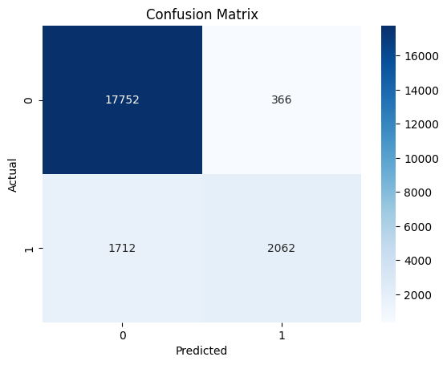

# ECG Arrhythmia Classification

This project builds a machine learning model to classify ECG (electrocardiogram) signals into normal and abnormal heart rhythms.

## Objective
- Analyze ECG heartbeat data
- Build a classification model
- Evaluate performance using standard metrics

## Dataset
- MIT-BIH ECG dataset (from Kaggle)
- Each sample represents a heartbeat signal

## Methodology
1. Data preprocessing and cleaning
2. Binary classification (normal vs abnormal)
3. Logistic Regression model training
4. Evaluation using accuracy and confusion matrix

## Results
- Model successfully classifies ECG signals
- Performance evaluated using:
  - Accuracy
  - Confusion Matrix

## Example Output
The model performance is evaluated using a confusion matrix to assess classification quality between normal and abnormal ECG signals.

## Model Performance

## Results
- Accuracy: 90.5%
- Model evaluated using confusion matrix

## Key Insight
- Dataset is imbalanced (normal >> abnormal)
- Model performs better on normal class
- Detecting abnormal heartbeats remains a challenge

## Interpretation
- The model shows strong performance in identifying normal heartbeats.
- However, there are misclassifications in abnormal cases, indicating potential challenges due to class imbalance.
- Further improvements can be made using more advanced models or balancing techniques.

## Key Insight
- Model performs well on normal cases
- Detection of abnormal signals can be improved

## Tech Stack
- Python
- Pandas
- Scikit-learn
- Matplotlib
- Seaborn

## Future Improvements
- Use advanced models (Random Forest, Neural Networks)
- Handle class imbalance
- Deploy as a real-time monitoring system

## Author
Vanessa Chriszella Rasubala